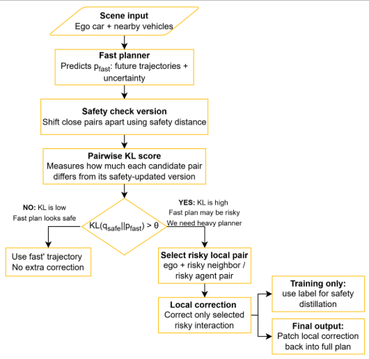

# KL-Triggered Local Refinement for Multi-Agent Motion Forecasting

A selective-compute framework for dense driving scenes.
The goal is to keep a fast probabilistic forecaster for most interactions and spend extra computation only on local agent pairs whose predictions strongly conflict with a safety-adjusted alternative.

## Problem

Multi-agent motion forecasting has a practical trade-off:
- A lightweight forecaster is fast enough for real-time use, but it can produce locally inconsistent or unsafe interactions.
- Refining the entire scene can improve safety, but it wastes computation when only one or two pairs are problematic.
- Distance alone is not enough to decide which close interactions require correction: the same geometric conflict can be more or less significant depending on predictive uncertainty.

The project asks:
> Can we identify only the interactions that truly need correction and refine them locally, instead of refining the whole scene?

## Core idea

The method uses KL divergence as a correction-necessity score.
A fast probabilistic forecaster first predicts future trajectories and uncertainty for all valid agents. Nearby pairs pass through a cheap distance gate. For each candidate pair, the method builds a minimally safety-adjusted distribution qsafe and compares it with the original forecast pfast.

If the KL divergence is high, the original prediction would need a meaningful safety correction, so only that local pair is sent to the heavier refiner.

## Method

  
   
   
   <ol>
      <li> <b>Fast probabilistic forecasting</b>  
      A lightweight model predicts a Gaussian future trajectory distribution for each agent:
      pfast = N(μ, σ2). </li>
      
      <li> <b>Distance pre-filter</b>  
      Clearly irrelevant pairs are removed using a cheap geometric gate based on dmin + safetymargin. </li>
      
      <li> <b>Safety-adjusted local distribution</b>  
      For candidate pairs that cross the hard separation boundary dmin, a minimally corrected local distribution qsafe is constructed.</li> 
      
      <li> <b>Pairwise KL trigger</b>  
      The method computes KL(qsafe || pfast). 
      High KL means that the predicted interaction strongly disagrees with the local safety correction.  </li>
      
      <li> <b>Contextual threshold and top-k selection </b>   
      The trigger threshold can adapt to scene density, predictive uncertainty, and the requested safety level. Only the highest-risk pairs are selected.</li>
      
      <li> <b>Local refinement</b>   
      The iterative refiner corrects only selected interacting pairs. Other agents keep the original fast forecast. </li>
      
      <li> <b>Safety distillation </b>  
      During training, KL-selected refined trajectories provide an auxiliary target for the fast forecaster while the original ground-truth forecasting loss is retained. </li>
   </ol>

## Results

