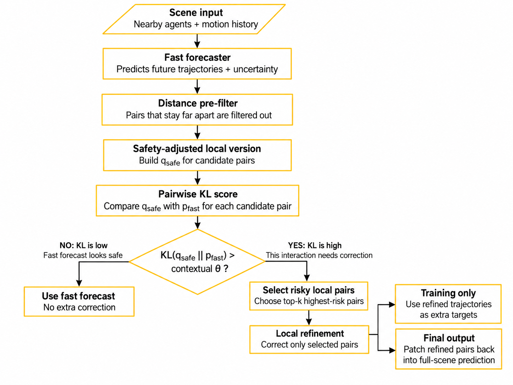

# KL-Triggered Local Refinement for Multi-Agent Motion Forecasting

A selective-compute framework for dense driving scenes.
The goal is to keep a fast probabilistic forecaster for most interactions and spend extra computation only on local agent pairs whose predictions strongly conflict with a safety-adjusted alternative.

## Problem

Multi-agent motion forecasting has a practical trade-off:
- A lightweight forecaster is fast enough for real-time use, but it can produce locally inconsistent or unsafe interactions.
- Refining the entire scene can improve safety, but it wastes computation when only one or two pairs are problematic.
- Distance alone is not enough to decide which close interactions require correction: the same geometric conflict can be more or less significant depending on predictive uncertainty.

The project asks:
> Can we identify only the interactions that truly need correction and refine them locally, instead of refining the whole scene?

## Core idea

The method uses KL divergence as a correction-necessity score.
A fast probabilistic forecaster first predicts future trajectories and uncertainty for all valid agents. Nearby pairs pass through a cheap distance gate. For each candidate pair, the method builds a minimally safety-adjusted distribution qsafe and compares it with the original forecast pfast.

If the KL divergence is high, the original prediction would need a meaningful safety correction, so only that local pair is sent to the heavier refiner.

## Method

1. **Fast probabilistic forecasting**
   A lightweight model predicts a Gaussian future trajectory distribution for each agent: `p_fast = N(μ, σ²)`.
2. **Distance pre-filter**
   Pairs that stay far apart are filtered out using a simple distance check based on `d_min + safety_margin`.
3. **Safety-adjusted local distribution**
   For candidate pairs that cross the hard separation boundary `d_min`, a minimally corrected local distribution `q_safe` is constructed.
4. **Pairwise KL trigger**
   The method computes `KL(q_safe || p_fast)`.
   High KL means that the predicted interaction strongly disagrees with the local safety correction.
5. **Contextual threshold and top-k selection**
   The trigger threshold adapts to scene density, predictive uncertainty, and the requested safety level. Only the highest-risk pairs are selected.
6. **Local refinement**
   The refiner corrects only selected interacting pairs. Other agents keep the original fast forecast.
8. **Safety distillation**
   During training, the refined trajectories of risky pairs are used as extra targets, while the model still learns from the original ground-truth trajectories.

   
## Results

